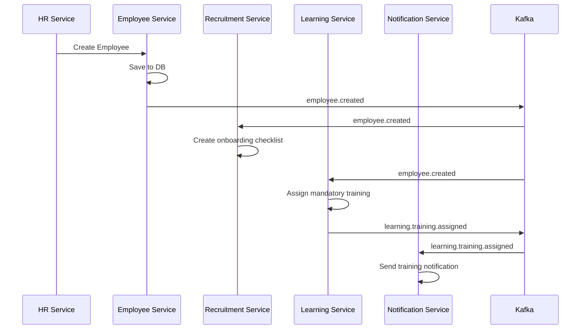
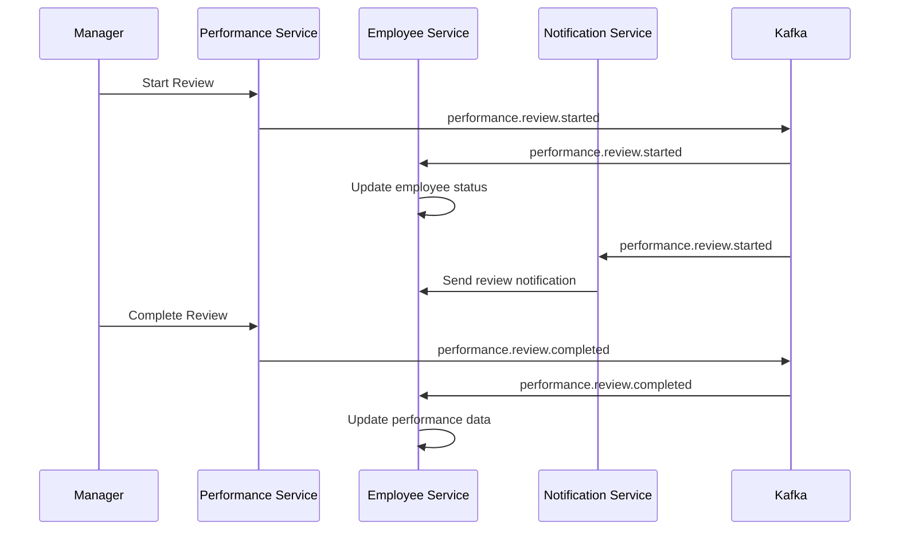

# Event-Driven Architecture Guide

## 🎯 **Event Organization Strategy**

The HRMS system uses a **hybrid event organization approach** that balances service autonomy with system consistency:

### **Shared Service Responsibilities:**
- **Base Event Interfaces** - Foundation for all events
- **System-Level Events** - Cross-service events (auth, notifications, audit)
- **Event Utilities** - Factories, validators, routers
- **Event Contracts** - Type-safe interfaces that services must implement
- **Topic Management** - Centralized topic definitions

### **Individual Service Responsibilities:**
- **Domain Events** - Service-specific business events
- **Event Handlers** - Business logic for processing events
- **Event Publishers** - Service-specific event publishing
- **Event Processing** - Domain-specific event processing logic

## 🏗️ **Architecture Benefits**

### ✅ **Advantages of This Approach:**

1. **Service Autonomy**: Services own their domain events
2. **Type Safety**: Shared contracts ensure consistency
3. **Loose Coupling**: Services don't depend on other services' event details
4. **Event Discovery**: Contracts make all events discoverable
5. **Consistent Structure**: Base interfaces ensure uniformity
6. **Easy Evolution**: Services can evolve events independently
7. **Testing**: Services can test events in isolation

### 🎮 **How It Works:**

```typescript
// 1. Shared service provides base interfaces and contracts
import { BaseEvent, EventFactory, EmployeeEvents } from '@hrms/shared';

// 2. Individual service implements the contract
interface EmployeeCreatedEvent extends EmployeeEvents.EmployeeCreated {
  // Service can extend with additional fields if needed
  metadata?: {
    importSource?: string;
    onboardingRequired: boolean;
  };
}

// 3. Service publishes event using shared utilities
const event = EventFactory.createEvent(
  'employee.created',
  'employee-service',
  {
    employeeId: 'emp-123',
    email: 'john.doe@company.com',
    firstName: 'John',
    lastName: 'Doe',
    departmentId: 'dept-456',
    startDate: new Date()
  }
);
```

## 📦 **Implementation Examples**

### **1. Employee Service Events**

```typescript
// employee-service/src/events/employee.events.ts
import { EventFactory, EmployeeEvents, KafkaService } from '@hrms/shared';

export class EmployeeEventPublisher {
  constructor(private kafkaService: KafkaService) {}

  async publishEmployeeCreated(data: EmployeeEvents.EmployeeCreated['data']) {
    const event = EventFactory.createEvent(
      'employee.created',
      'employee-service',
      data
    );

    await this.kafkaService.getProducer()
      .publishEvent('employee-events', event);
  }

  async publishEmployeeUpdated(data: EmployeeEvents.EmployeeUpdated['data']) {
    const event = EventFactory.createEvent(
      'employee.updated',
      'employee-service',
      data
    );

    await this.kafkaService.getProducer()
      .publishEvent('employee-events', event);
  }
}
```

### **2. Recruitment Service Event Handlers**

```typescript
// recruitment-service/src/events/handlers/employee.handler.ts
import { KafkaConsumer, EmployeeEvents } from '@hrms/shared';

export class EmployeeEventHandler {
  static async handleEmployeeCreated(
    event: EmployeeEvents.EmployeeCreated,
    metadata: any
  ) {
    // Business logic: Create candidate profile for new employee
    console.log(`New employee created: ${event.data.employeeId}`);
    
    // Could trigger additional events like:
    // - Create onboarding checklist
    // - Send welcome email
    // - Create default training assignments
  }

  static async handleEmployeeDeactivated(
    event: EmployeeEvents.EmployeeDeactivated,
    metadata: any
  ) {
    // Business logic: Close any open job applications for this employee
    console.log(`Employee deactivated: ${event.data.employeeId}`);
  }
}

// Register handlers
const consumer = kafkaService.getConsumer();
consumer.registerEventHandler('employee.created', EmployeeEventHandler.handleEmployeeCreated);
consumer.registerEventHandler('employee.deactivated', EmployeeEventHandler.handleEmployeeDeactivated);
```

### **3. Service-to-Service Communication**

```typescript
// performance-service/src/events/handlers/learning.handler.ts
import { LearningEvents, EventFactory } from '@hrms/shared';

export class LearningEventHandler {
  static async handleCourseCompleted(
    event: LearningEvents.CourseCompleted,
    metadata: any
  ) {
    // When employee completes a course, update their skills
    const skillsUpdated = await updateEmployeeSkills(
      event.data.employeeId,
      event.data.courseId
    );

    if (skillsUpdated) {
      // Publish performance-related event
      const performanceEvent = EventFactory.createEvent(
        'performance.skills.updated',
        'performance-service',
        {
          employeeId: event.data.employeeId,
          courseId: event.data.courseId,
          updatedSkills: skillsUpdated,
          source: 'course_completion'
        },
        event.correlationId // Maintain correlation
      );

      await kafkaService.getProducer()
        .publishEvent('performance-events', performanceEvent);
    }
  }
}
```

## 🛠️ **Best Practices**

### **1. Event Naming Convention**
```
{domain}.{entity}.{action}
├── employee.profile.created
├── recruitment.application.submitted
├── performance.review.completed
└── learning.course.enrolled
```

### **2. Event Versioning**
```typescript
// Version events for backward compatibility
const event = EventFactory.createEvent(
  'employee.created',
  'employee-service',
  data,
  correlationId,
  'v2.0.0' // Version
);
```

### **3. Error Handling**
```typescript
// Handle failed events gracefully
consumer.registerEventHandler('employee.created', async (event, metadata) => {
  try {
    await processEmployee(event.data);
  } catch (error) {
    // Publish error event for monitoring
    const errorEvent = EventFactory.createEvent(
      'error.processing.failed',
      'recruitment-service',
      {
        originalEvent: event.id,
        error: error.message,
        retryCount: metadata.retryCount || 0
      }
    );
    
    await publishErrorEvent(errorEvent);
  }
});
```

### **4. Event Ordering & Idempotency**
```typescript
// Ensure events are idempotent
export class IdempotentEventHandler {
  private processedEvents = new Set<string>();

  async handleEvent(event: BaseEvent) {
    if (this.processedEvents.has(event.id)) {
      console.log(`Event ${event.id} already processed, skipping`);
      return;
    }

    await this.processEvent(event);
    this.processedEvents.add(event.id);
  }
}
```

## 📊 **Event Flow Examples**

### **Employee Onboarding Flow**


### **Performance Review Flow**


## 🔧 **Configuration & Setup**

### **1. Service Configuration**
```typescript
// Each service configures which events it listens to
const serviceConfig = {
  subscriptions: [
    'employee-events',     // Listen to employee events
    'system-events',      // Listen to system events
  ],
  publications: [
    'recruitment-events', // Publish recruitment events
    'notification-events' // Publish notification requests
  ]
};
```

### **2. Topic Management**
```typescript
// Topics are managed centrally but services define their event types
export const TOPICS = {
  EMPLOYEE_EVENTS: 'employee-events',
  RECRUITMENT_EVENTS: 'recruitment-events',
  PERFORMANCE_EVENTS: 'performance-events',
  LEARNING_EVENTS: 'learning-events',
  SYSTEM_EVENTS: 'system-events',
  NOTIFICATION_EVENTS: 'notification-events',
  AUDIT_EVENTS: 'audit-events',
} as const;
```

This architecture provides the perfect balance between service autonomy and system consistency, making it easy to scale and maintain the HRMS system as it grows.
